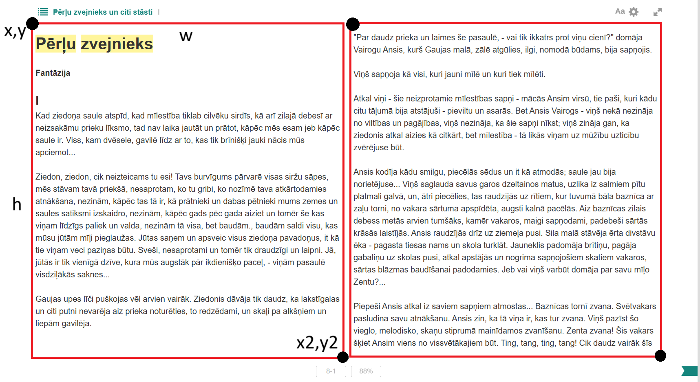

# LetonikaReader

A Python automation script that extracts text from a digitally viewed book using OCR (Optical Character Recognition) and saves it to a plain text file.
It will output screenshots made for the first page to check if L/R region setup is right.
Next it will make 2 screenshots per page and use OCR to convert screenshot to text after which it will automatically click arrow right (->) to flip to next page. 

## Dependencies

Make sure you have pthon 3.x installed to PATH as well as pyautogui.
Install pyautogui by running the following command:
    
    pip install pyautogui

## Installation

Install program by navigating to directory you want to install it to and cloning this repository:

    git clone https://github.com/jekabsv/LetonikaReader

## Setup

Before running the script you need to set it up.

In the script code find the following lines:

    LEFT_REGION  = (185, 125, 760, 835)   # x, y, platums, augstums
    RIGHT_REGION = (964, 141, 786, 806)   # x, y, platums, augstums

L/R Region is defined by origin x,y and rectangle width,height.  
origin is located at the regions upper left corner.

You can find mouse coordinates by running the following command:

    python -c "import pyautogui; pyautogui.displayMousePosition()"

## Pages

Next you need to set the amount of pages in a book.  
Find the following line:

    # Cik lapas ieskaitot šobrīdējo
    TOTAL_PAGES = 72

## Running

After setting this up you are ready to run the script.  
After running the script you will have 3 seconds to switch to book window and click on it to focus.
